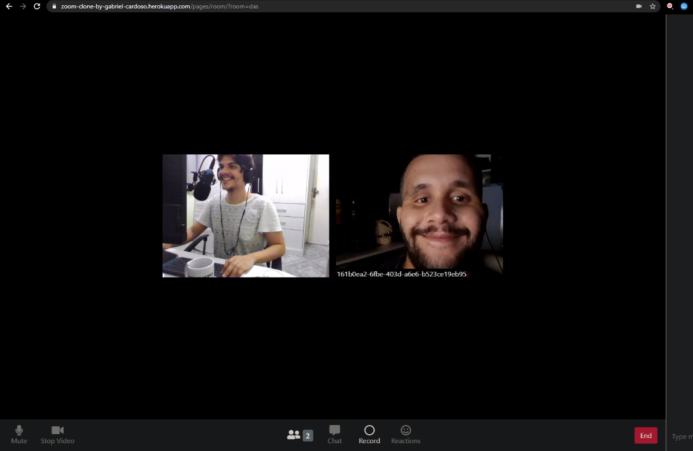

## Example

## Home Page

## Room

# Credits
### Special thanks to [Erick Wendel](https://github.com/ErickWendel) thats produced this special, unique and awsome content to programers with experience
### Base project at JS Expert Week 2.0
### forked from https://github.com/ErickWendel/jsexpert02-skeleton-ew

- Access the [home](./public/pages/home/index.html) to access the home page
- Access the [room](./public/pages/room/index.html) a specific room

- Home layout was based on the codepen of the [Nelson Adonis Hernandez](https://codepen.io/nelsonher019/pen/eYZBqOm)
- Room layout was adapted from the channel repo [CleverProgrammers](https://github.com/CleverProgrammers/nodejs-zoom-clone/blob/master/views/room.ejs)
